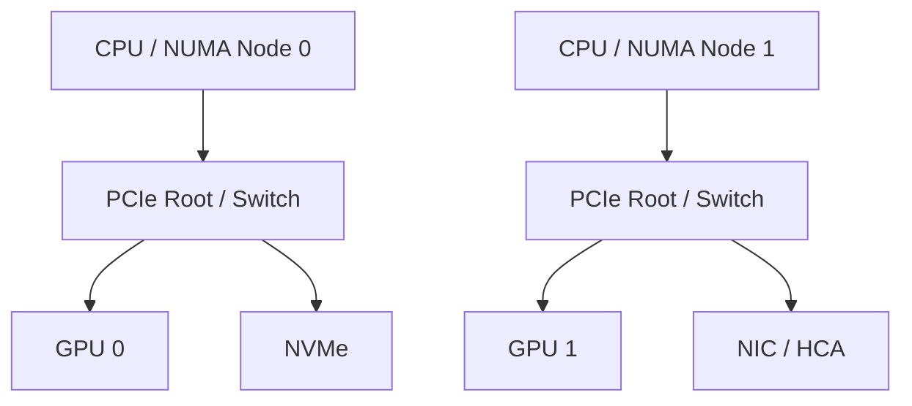

# Topology-Faultline

> **Case File 07: The Missing Bandwidth — investigate why supposedly identical AI compute nodes behave differently when the hidden hardware topology is not identical at all.**

## Skills you will build

- CPU socket and NUMA fundamentals
- PCIe hierarchy, root complexes, switches, lanes, and link width
- GPU placement and peer-to-peer topology
- `lscpu`, `lspci`, `numactl`, sysfs, and topology inspection
- `nvidia-smi topo` and GPU locality reasoning where supported
- NVLink and NVSwitch architecture concepts
- NIC/HCA and NVMe locality
- Affinity, locality, and performance-path reasoning
- Architecture diagramming from real system evidence
- Separating measured behavior from modeled enterprise hardware

## General idea

Topology-Faultline is a **hardware-forensics lab**.

A fictional AI platform team reports a strange problem: one compute node consistently underperforms another even though the inventory system claims the two machines have the same CPUs, GPUs, memory, and network adapters.

Nothing is obviously broken.

The mystery lives in the paths **between** the components.

Your job is to investigate CPU sockets, NUMA domains, PCIe roots, GPUs, storage, and network adapters until you can explain how physical placement changes the path data must travel.

The core question is:

> **What path does the data actually take through the machine, and where does topology make that path expensive?**

The laptop provides a real system to inspect. Large multi-GPU, NVSwitch, SXM, and HCA topologies can then be reconstructed from public reference architectures and clearly labeled as modeled cases rather than claimed local hardware.

---

# The case: Node A is fast. Node B is not.

The hardware inventory says:

```text
NODE A                       NODE B
------                       ------
Same CPU family              Same CPU family
Same memory capacity         Same memory capacity
Same GPU model               Same GPU model
Same NIC class               Same NIC class
Same storage class           Same storage class
```

Operations says the nodes are equivalent.

The workload team says they are not.

You have been asked to determine whether topology can explain the difference before anyone starts replacing expensive hardware.

The investigation begins with one rule:

> **Inventory tells you what exists. Topology tells you how it is connected.**

---

## Investigation board

| Case | Mystery | Concept | Evidence you should produce |
|---|---|---|---|
| 00 | **Draw the Crime Scene** | CPU, memory, buses, devices | diagram your actual laptop/system |
| 01 | **The NUMA Alibi** | sockets, NUMA nodes, memory locality | explain local vs remote memory paths |
| 02 | **Follow the PCIe Trail** | root complexes, buses, bridges, lanes | reconstruct a PCIe tree |
| 03 | **The GPU's Neighbors** | GPU locality, peer paths | identify what shares the GPU's path |
| 04 | **The Storage Accomplice** | NVMe/PCIe locality | trace storage-to-CPU/GPU path |
| 05 | **The Network Getaway Car** | NIC/HCA locality | reason about GPU-to-network paths |
| 06 | **Affinity Gone Wrong** | CPU pinning, memory placement | demonstrate why placement matters |
| 07 | **The Eight-GPU Mansion** | DGX/HGX-style topology | reconstruct a modeled multi-GPU server |
| 08 | **Secret Passageways** | NVLink/NVSwitch | compare PCIe-only and high-speed peer paths |
| 09 | **Same Parts, Different Machine** | topology comparison | explain how two builds can behave differently |
| FINAL | **The Missing Bandwidth** | cross-layer topology reasoning | solve an unknown performance-path case |

---

## The forensic toolkit

You will learn commands as investigative instruments, not trivia:

```bash
lscpu
lspci
lspci -tv
lspci -vv
numactl --hardware
cat /sys/devices/system/node/online
find /sys -path '*numa_node*'
nvidia-smi
nvidia-smi topo -m
```

The question behind each tool matters more than the syntax:

```text
lscpu             → What CPU/socket/NUMA structure does Linux see?
lspci -tv         → What does the PCIe tree look like?
lspci -vv         → What capabilities and negotiated links exist?
numactl --hardware→ Which CPUs and memory belong to which NUMA nodes?
nvidia-smi topo   → How does NVIDIA describe GPU/CPU/NIC locality?
```

---

## The evidence wall

Every case should add something to an evolving system map.



Your actual machine may be much simpler. That is useful. The project should first prove you can map **real topology**, then scale the reasoning to more complicated reference systems.

---

## Lab loop

Each investigation follows this pattern:

### 1. Claim
Make a prediction about the hardware path.

### 2. Evidence
Use OS and device information to reconstruct the path.

### 3. Diagram
Draw what you believe the system actually looks like.

### 4. Experiment
Where possible, change CPU affinity, memory placement, workload placement, or I/O behavior.

### 5. Explain
Connect the observation back to topology.

### 6. Scale
Ask how the same issue would appear in a multi-GPU AI server.

---

## Cases that make the project interesting

Later case files can ask questions such as:

- Why would a GPU and NIC on different NUMA domains hurt a communication path?
- Why can two GPUs in one server have different peer-to-peer costs?
- What changes when traffic crosses a PCIe switch?
- When does CPU affinity matter to an accelerator workload?
- Why do NVLink and NVSwitch exist when PCIe already connects GPUs?
- Why does an HCA's physical location matter to distributed training?
- What would a scheduler need to know to make topology-aware placement decisions?

You are not trying to memorize every NVIDIA platform diagram.

You are learning how to **read one like an engineer**.

---

## Evidence to keep

Good artifacts include:

- annotated `lspci` trees
- NUMA maps
- real machine topology diagrams
- GPU/NIC/storage locality notes
- small affinity experiments
- before/after observations
- modeled DGX/HGX topology diagrams with sources
- case reports explaining a suspected bottleneck

Never represent a reference-system topology as hardware you personally operated.

---

## Suggested repository structure

```text
Topology-Faultline/
├── README.md
├── case-files/
├── real-system/
├── modeled-systems/
├── diagrams/
├── experiments/
├── evidence/
└── notes/
```

---

## Completion standard

Topology-Faultline is complete when you can be shown a complex compute-node diagram and confidently explain:

- which CPU/NUMA domain owns which devices,
- which communication paths remain local,
- which paths cross expensive boundaries,
- where PCIe, NVLink/NVSwitch, NICs, and storage fit,
- and how poor placement could become a performance problem.

The final artifact should read like a technical investigation:

> **"The parts were healthy. The path was wrong."**
